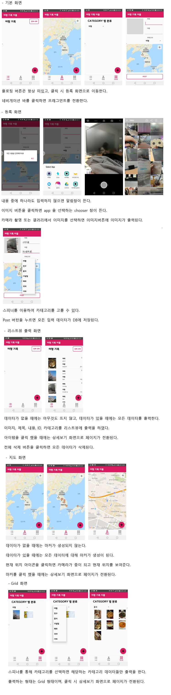
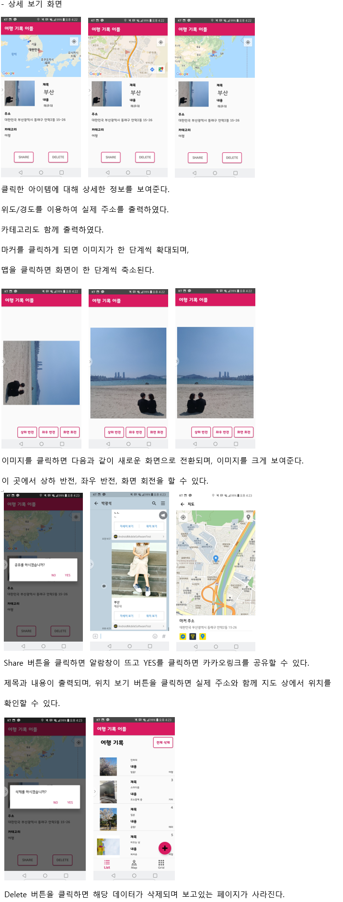

# 여행관리어플리케이션 ( 2019년도 1학기 )  
* [동영상 링크](https://www.youtube.com/watch?v=dqBLQVdJ3R8&t=49s "유튜브")  
* 응용 프로그램에 사용되는 SQLite DB와 구글맵·카카오링크 API를 이용한 ‘여행 기록 관리 앱’을 개발.  
* Bottom Navigation + fragment 를 이용한 화면 전환.  
* 사용자지정 ListView, Floating button, Chooser, alert 사용  
* 위도,경도,제목,내용,사진을 합쳐서 공유하는 기능을 구현  
* Grid 식 이미지 갤러리 구현  
  
  

